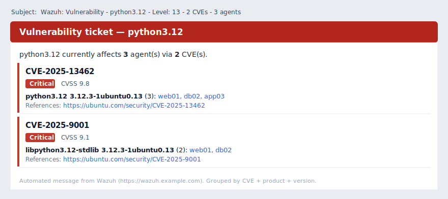
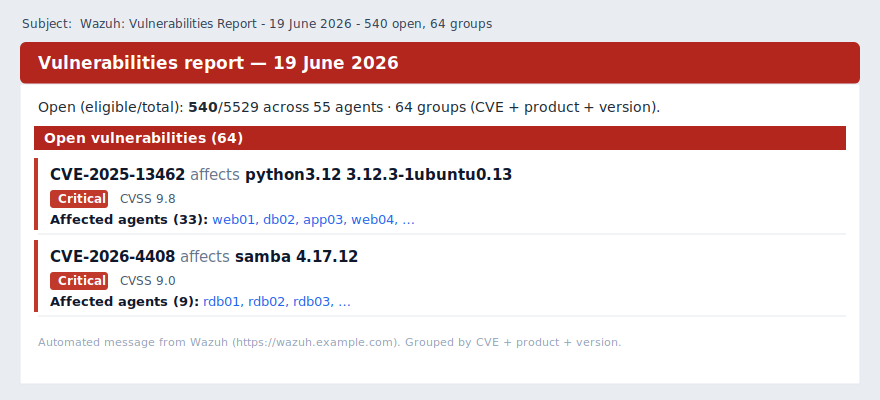

# Vulnerability Email Digest

Turn Wazuh's vulnerability **inventory** into clean, de-duplicated email tickets — **one mail per
product to remediate**, not one per CVE, per package, or per agent. Choose which severities to
include (`--severity`, default: all).

Wazuh's Vulnerability Detection only emits an *alert event* when a finding's state **changes** (newly
detected or solved). An agent that has been vulnerable for weeks therefore produces no alert, even
though the dashboard still lists it — so alert-driven email integrations silently miss most of your
real exposure, and the ones they do send arrive one-per-CVE-per-agent. This recipe reads the current
**state index** (`wazuh-states-vulnerabilities-*`) directly, so it sees *everything currently open*,
and collapses it into actionable, low-noise tickets with a small stateful poller.

## What you get

- **Complete coverage** — reads the live inventory, so every currently-vulnerable agent is included, not just the ones that changed state in the last scan.
- **One ticket per remediation** — all CVEs, versions and agents of a product are merged into a single mail (e.g. `apt upgrade python3.12` → one ticket, not 5 sub-package mails).
- **Notify-once** — each finding is emailed exactly once; it is never re-announced while it stays open.
- **Anti-flap** — Wazuh re-stamps some findings daily; a finding only counts as *resolved* after it has been gone for a grace window (default 7 days), so daily re-scans don't generate repeat mail.
- **HTML email** — severity-coloured, with CVSS, references, affected agents as **clickable dashboard deep-links**, plus a plain-text fallback.
- **Two cadences** — hourly *tickets* (new/resolved), and a separate weekly *report* (full current open state).
- **Resolved notices** and a periodic *still-open* reminder.

## What it looks like

A per-product **ticket** (hourly) and the weekly **report** — HTML, severity-coloured, with affected
agents as clickable dashboard links and a plain-text fallback:





*Illustrative mockups with synthetic data.*

## How it works

```
 Wazuh Indexer  (wazuh-states-vulnerabilities-*)   = current vulnerability inventory
        │  HTTPS query (optional --severity filter)
        ▼
 wazuh_vuln_digest.py ─┬─ SQLite state DB     (notify-once + resolve-grace de-dup)
                       ├─ group by PRODUCT FAMILY  (merge a product's CVEs, versions, sub-packages)
                       └─ SMTP ─▶ HTML ticket  (one mail per product, agents deep-linked)

 systemd timers:  hourly  → NEW / RESOLVED tickets   (stateful, writes the DB)
                  weekly  → full open-state report   (stateless, never writes the DB)
```

The poller queries the indexer (optionally filtered by `--severity`), applies an optional exclusion
list, and reconciles the result against a small SQLite database. A finding is keyed by
`(agent, CVE, package, version)`; the database remembers what has been mailed (`notified_at`) and when
each finding was last seen. For the email, findings are bucketed into a **product family** (embedded
versions, the `lib` prefix and Debian sub-package suffixes like `-minimal`/`-stdlib`/`t64` are
stripped; a small curated alias list folds heterogeneous sets such as samba) so the output is one mail
per product to fix.

## Repository layout

```
bin/
  wazuh_vuln_digest.py              # the poller (query → de-dup → group → email)
systemd/
  wazuh-vuln-digest.service/.timer  # hourly tickets (NEW / RESOLVED), stateful
  wazuh-vuln-report.service/.timer  # weekly report (full open state), stateless
  wazuh-vuln-digest.env.example     # secrets + overrides (copy to a 0600 env file)
```

## Requirements

- **Wazuh 4.8+** with Vulnerability Detection writing state to the indexer
  (`<vulnerability-detection><index-status>yes</index-status>` in `ossec.conf`, so
  `wazuh-states-vulnerabilities-*` is populated).
- Network + read access from the host running the script to the Wazuh Indexer (default
  `https://127.0.0.1:9200`) — ideally a **dedicated read-only indexer user**.
- An SMTP relay the host may send through.
- Python **3.8+** and [`opensearch-py`](https://pypi.org/project/opensearch-py/) (installed in a venv below). No other third-party dependency.

## Installation

The script needs only to **read** the indexer, **write** a small SQLite file, and **send** mail —
none of which requires root. Run it as a **dedicated, unprivileged service user** rather than as
root; the systemd units assume `wazuh-vuln`.

### 1. Service user, directory and venv

```bash
sudo useradd --system --no-create-home --shell /usr/sbin/nologin wazuh-vuln
sudo install -d -o wazuh-vuln -g wazuh-vuln /opt/wazuh-vuln-digest
sudo -u wazuh-vuln python3 -m venv /opt/wazuh-vuln-digest/venv
sudo -u wazuh-vuln /opt/wazuh-vuln-digest/venv/bin/pip install opensearch-py
sudo install -o wazuh-vuln -g wazuh-vuln -m 0750 bin/wazuh_vuln_digest.py /opt/wazuh-vuln-digest/
```

### 2. Secrets (read-only indexer user recommended)

Create a read-only user on the indexer for this tool, then store its password in an env file readable
only by the service user (keeps it out of `ps`, the unit file and git):

```bash
sudo cp systemd/wazuh-vuln-digest.env.example /opt/wazuh-vuln-digest/wazuh-vuln-digest.env
sudoedit /opt/wazuh-vuln-digest/wazuh-vuln-digest.env      # set WAZUH_INDEXER_PASSWORD etc.
sudo chown wazuh-vuln:wazuh-vuln /opt/wazuh-vuln-digest/wazuh-vuln-digest.env
sudo chmod 600 /opt/wazuh-vuln-digest/wazuh-vuln-digest.env
```

TLS: by default the script verifies against `/etc/filebeat/certs/root-ca.pem`. If `wazuh-vuln` can't
read that path, point `--ca` at a readable copy of the indexer CA, or use `--no-verify` for a
localhost connection.

### 3. Seed the baseline (no email)

Record everything currently open as the baseline so the first scheduled run doesn't email your whole
backlog:

```bash
sudo -u wazuh-vuln /opt/wazuh-vuln-digest/venv/bin/python \
  /opt/wazuh-vuln-digest/wazuh_vuln_digest.py --seed
```

### 4. Install the timers

Edit the `--recipients` (and any paths) in the two `.service` files, then:

```bash
sudo cp systemd/wazuh-vuln-*.{service,timer} /etc/systemd/system/
sudo systemctl daemon-reload
sudo systemctl enable --now wazuh-vuln-digest.timer wazuh-vuln-report.timer
systemctl list-timers | grep wazuh-vuln
```

> The services are `Type=oneshot`, so `systemctl status …service` normally shows `inactive (dead)` —
> that's expected; the **timer** is what matters.

## Usage

```bash
PY=/opt/wazuh-vuln-digest/venv/bin/python
APP=/opt/wazuh-vuln-digest/wazuh_vuln_digest.py

sudo -u wazuh-vuln $PY $APP --dry-run                              # preview, no mail, no DB change
sudo -u wazuh-vuln $PY $APP --seed                                 # (re)set the baseline, no mail
sudo -u wazuh-vuln $PY $APP --report --recipients you@example.com  # full open-state report now
sudo -u wazuh-vuln $PY $APP --test-cve CVE-2025-13462 --recipients you@example.com   # test one CVE
sudo -u wazuh-vuln $PY $APP --test-report --recipients you@example.com               # sample report
sudo -u wazuh-vuln $PY $APP --severity Critical,High --dry-run                        # restrict severities
```

| Option | Meaning |
|--------|---------|
| `--severity a,b` | Severities to include, e.g. `Critical,High` (or `DIGEST_SEVERITY` env). **Empty = all severities** |
| `--dry-run` | Print what would be sent; send nothing, change nothing |
| `--seed` | Record the current findings as the baseline (no mail) |
| `--report` | Send the full current-state report (stateless) |
| `--test-cve <CVE>` | One-off test ticket for a CVE (no DB change) |
| `--test-report` | Sample report from current inventory (no DB change) |
| `--recipients a@x,b@y` | Recipient list (or `DIGEST_RECIPIENTS` env / per-unit) |
| `--renotify-days N` | "Still open" aging reminder threshold (default 30) |
| `--resolve-grace-hours N` | Absence before a finding counts as resolved (default 168 = 7 days) |
| `--no-verify` / `--ca PATH` | Indexer TLS handling |

## Configuration

All near the top of `bin/wazuh_vuln_digest.py`:

- **Severity** — pass `--severity Critical,High` (or set `DIGEST_SEVERITY`) to restrict; empty (the default) includes every severity.
- **`EXCLUDED_PACKAGES`** (empty by default) + the substring hook in `is_excluded` — packages recorded in the DB but never emailed. Add your own noise (e.g. kernels `linux-image*`, AD/SSSD packages) to taste.
- **`_FAMILY_ALIASES`** — fold products whose package names share no common stem into one ticket (samba is pre-seeded; add your own, e.g. `("openssl", ("libssl", "openssl"))`).
- **`RESOLVE_GRACE_HOURS`** / **`DEFAULT_RENOTIFY_DAYS`** — anti-flap and aging thresholds.
- Connection/SMTP/dashboard defaults are read from env (`WAZUH_INDEXER_PASSWORD`, `SMTP_SERVER`, `MAIL_FROM`, `WAZUH_DASHBOARD`, `DIGEST_RECIPIENTS`, `DIGEST_SEVERITY`) — see the env example.

Tickets (hourly) and the report (weekly) are independent jobs with **their own `--recipients`** in
their respective `.service` files — point tickets at your queue and the report at a team inbox if you
like.

## Verifying

```bash
# Does it reach the indexer and parse the inventory? (counts only, no mail)
sudo -u wazuh-vuln /opt/wazuh-vuln-digest/venv/bin/python \
  /opt/wazuh-vuln-digest/wazuh_vuln_digest.py --dry-run

# Trigger a run on demand and read its output:
sudo systemctl start wazuh-vuln-digest.service
journalctl -u wazuh-vuln-digest.service -n 30 --no-pager
```

A healthy `--dry-run` prints a `[notify] … severity=… total=… eligible=…` line and a
`[dry-run] would send N new product-ticket(s) …` summary.

## Limitations

- **All severities by default.** Use `--severity Critical,High` to focus and avoid noise on large fleets.
- **Family grouping is heuristic.** Same-product sub-packages usually merge; products whose package
  names share no stem need a `_FAMILY_ALIASES` entry (or they arrive as separate tickets).
- **Inventory-diff, not event-stream.** If an agent is offline longer than the resolve grace, its
  findings are reported resolved and then new again on return — raise `--resolve-grace-hours` to absorb
  longer outages.
- HTML is built for broad client support (table + `bgcolor`); exotic dark-mode clients may still
  recolour backgrounds, but the severity accents always render.

## License

MIT (inherits the repository [LICENSE](../LICENSE)).
